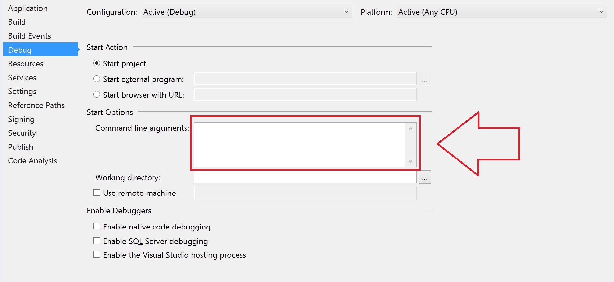

- [Pre-built binaries](#prebuilt)
- [Building](#building)
- [Testing](#testing)
  - [Usage](#testing-usage)
  - [Examples](#testing-examples)


This application is a reference implementation for developers to show how to use the C# API and could
be used to easily check the accuracy. The C# API is a wrapper around the C++ API defined at [https://www.doubango.org/SDKs/mrz/docs/cpp-api.html](https://www.doubango.org/SDKs/mrz/docs/cpp-api.html).

The application accepts path to a JPEG/PNG/BMP file as input. This **is not the recommended** way to use the API. We recommend reading the data directly from the camera and feeding the SDK with the uncompressed **YUV data** without saving it to a file or converting it to RGB.

If you don't want to build this sample and is looking for a quick way to check the accuracy then, try
our cloud-based solution at [https://www.doubango.org/webapps/mrz/](https://www.doubango.org/webapps/mrz/).

This sample is open source and doesn't require registration or license key.

<a name="prebuilt"></a>
# Pre-built binaries #

If you don't want to build this sample by yourself then, use the pre-built C++ versions:
 - Windows: [recognizer.exe](../../../binaries/windows/x86_64/recognizer.exe) under [binaries/windows/x86_64](../../../binaries/windows/x86_64)
 - Linux: [recognizer](../../../binaries/linux/x86_64/recognizer) under [binaries/linux/x86_64](../../../binaries/linux/x86_64). Built on Ubuntu 18.
 - Raspberry Pi: [recognizer](../../../binaries/raspbian/armv7l/recognizer) under [binaries/raspbian/armv7l](../../../binaries/raspbian/armv7l)
 - Android: check [android](../../android) folder
 - iOS: check [ios](../../ios) folder
 
On **Windows**, the easiest way to try this sample is to navigate to [binaries/windows/x86_64](../../../binaries/windows/x86_64/) and run [binaries/windows/x86_64/recognizer.bat](../../../binaries/windows/x86_64/recognizer.bat). You can edit these files to use your own images and configuration options.

<a name="building"></a>
# Building #

This sample contains [a single C# source file](Program.cs).

You'll need Visual Studio to build the code. The VS project is at [recognizer.vcxproj](recognizer.vcxproj). Open it.
 - You will need to change the **"Command line arguments"** like the [below image](../../../VC#_config.jpg). Default value: `--assets "$(ProjectDir)..\..\..\assets" --image "$(ProjectDir)..\..\..\assets\images\Czech_passport_2005_MRZ_orient1_1300x1002.jpg"`
 

 
You're now ready to build and run the sample.

<a name="testing-usage"></a>
## Usage ##

`recognizer` is a command line application with the following usage:
```
recognizer \
      --image <path-to-image-with-mrzdata-to-process> \
      [--assets <path-to-assets-folder>] \
      [--tokenfile <path-to-license-token-file>] \
      [--tokendata <base64-license-token-data>]
```
Options surrounded with **[]** are optional.
- `--image` Path to the image(JPEG/PNG/BMP) to process. You can use default image at [../../../assets/images/Czech_passport_2005_MRZ_orient1_1300x1002.jpg](../../../assets/images/Czech_passport_2005_MRZ_orient1_1300x1002.jpg).
- `--assets` Path to the [assets](../../../assets) folder containing the configuration files and models. Default value is the current folder.
- `--tokenfile` Path to the file containing the base64 license token if you have one. If not provided then, the application will act like a trial version. Default: *null*.
- `--tokendata` Base64 license token if you have one. If not provided then, the application will act like a trial version. Default: *null*.

<a name="testing-examples"></a>
## Examples ##
You'll need to change the Visual Studio properties to define the command line arguments.

```
recognizer.exe \
    --image ../../../assets/images/Czech_passport_2005_MRZ_orient1_1300x1002.jpg \
    --assets ../../../assets
```

Please note that if you're cross compiling the application then you've to make sure to copy the application and both the [assets](../../../assets) and [binaries](../../../binaries) folders to the target device.


